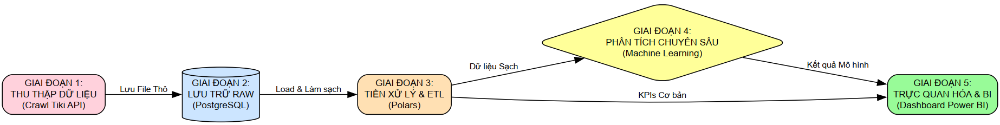
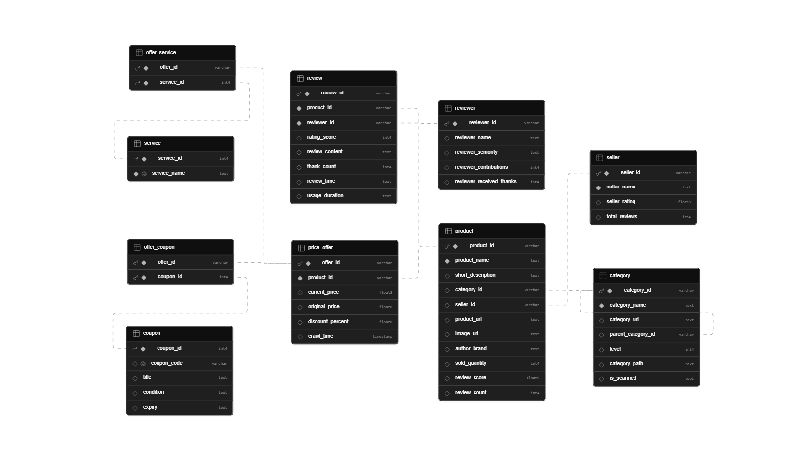
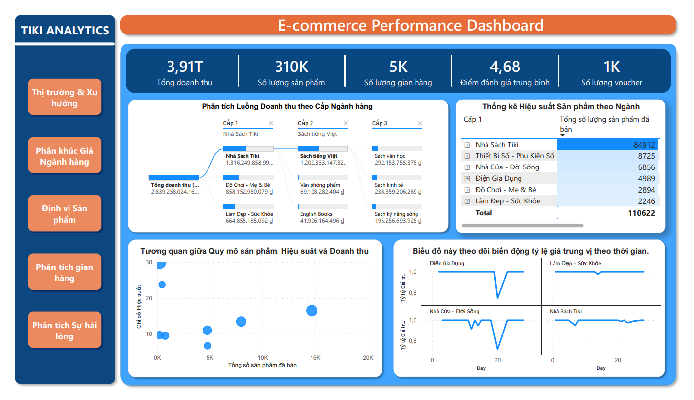
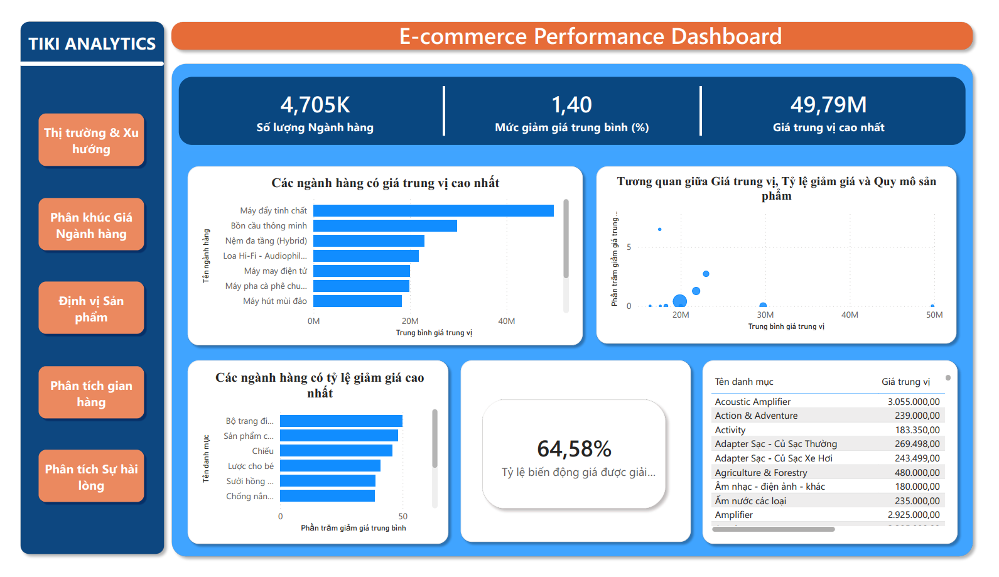
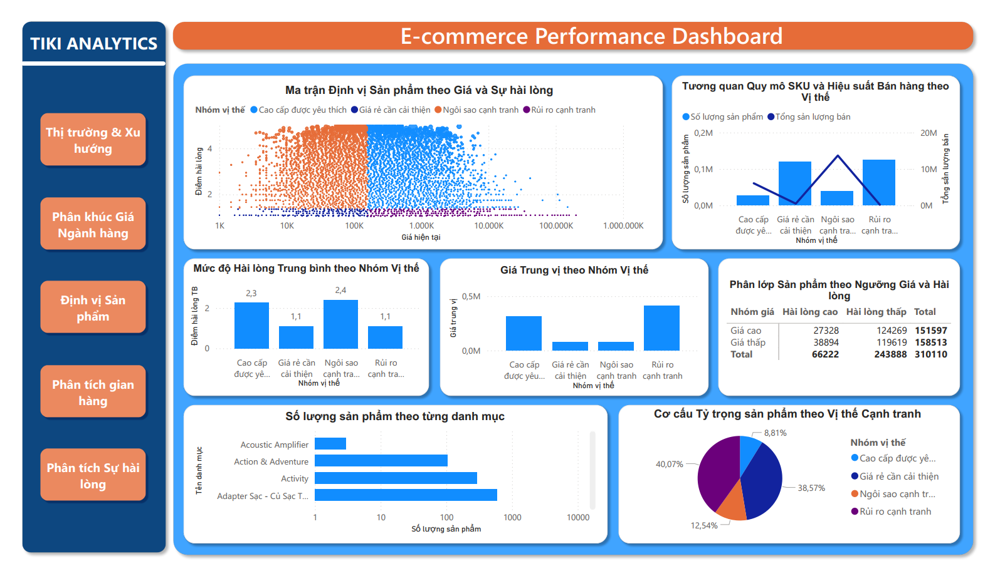
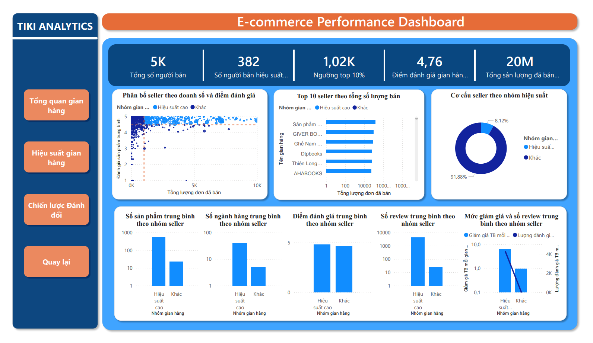
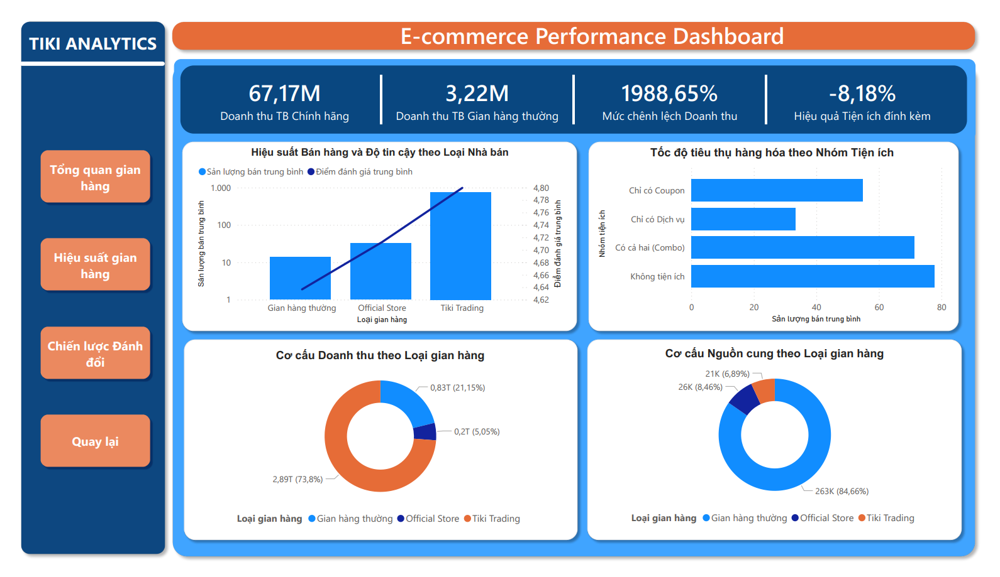
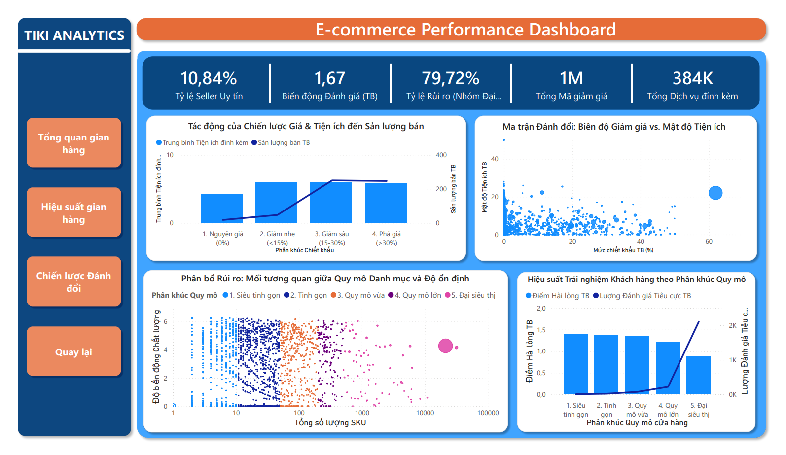
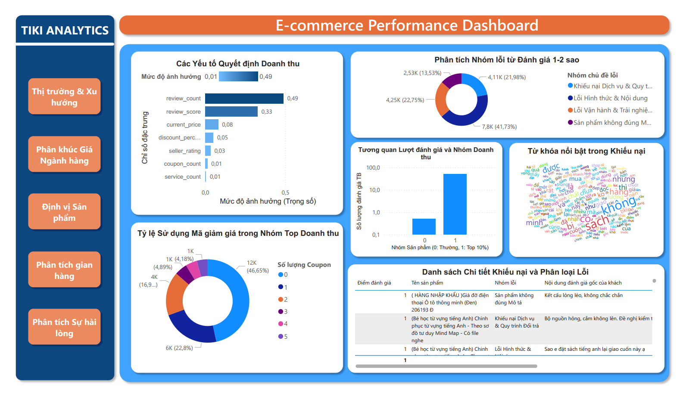

# 🛒 E-commerce Data Analysis (Tiki) — Dashboard & AI Assistant


End-to-end data project that **measures how pricing, promotions, and customer feedback interact on Vietnam’s Tiki marketplace**. The work connects a custom crawl → relational storage → high-performance ETL → analytics, ML, NLP, and executive dashboards so decisions are grounded in **observed seller and buyer behavior**, not assumptions.

## 🔗 Demo

- **Live dashboard (deploy)**: `https://ecommerce-data-analysis-production-b558.up.railway.app/`

## 📋 Overview

E-commerce moves fast: sellers need **evidence-based positioning** (what to list, how to price, when to promote) and **operational clarity** on what drives dissatisfaction. This repository supports a capstone-style analysis framed as:

> *Quantify price structure and customer satisfaction on-platform to describe what distinguishes high-performing listings and stores.*

The pipeline spans **multi-threaded crawling**, a **normalized PostgreSQL schema** (products, time-stamped offers, services/coupons, reviews), **Polars-based cleaning**, and **Power BI** storytelling for stakeholders.

**Business value:** clearer **category expansion**, **promotion timing**, **seller benchmarking**, and **CX fixes** tied to review themes—not generic “more SKUs” or “deeper discounts.”

### End-to-end pipeline



---

## 🎯 Objectives

- **Commercial positioning:** Map **revenue potential** (`current_price × sold_quantity`) across **three category levels**; surface **high-efficiency L3 niches** (small SKU count but outsized contribution vs. their L1 average).
- **Promotional intelligence:** Track **price ratio** (`current_price / original_price`) over time for major verticals to infer **industry-specific “sale cycles”** and improve **flash-sale timing**.
- **Drivers of sales performance:** Use **Random Forest** to separate **top 10% products by sales** from the rest and interpret **feature importance** (e.g., rating, review volume, attached services).
- **Voice of the customer:** Apply **LDA topic modeling** on large samples of **1–2★ reviews** to label **dominant failure modes** (service, fulfillment, product mismatch, etc.).
- **Seller archetypes:** Contrast **Tiki Trading / Official Store / marketplace** sellers; segment products by **utilities** (coupon/service bundles); relate **catalog breadth**, **discount depth**, and **satisfaction stability**.

---

## 💾 Dataset

| Aspect | Detail |
|--------|--------|
| **Source** | [Tiki](https://tiki.vn) — product listings, pricing history, seller metadata, and customer reviews |
| **Collection** | In-house **Python crawler** (category tree → product pages → review text), with **multi-threading** for scale |
| **Storage** | Raw and structured data in **PostgreSQL** (10+ normalized entities: `category`, `product`, `seller`, `price_offer`, `service`, `coupon`, `review`, etc.) |
| **Analytics artifacts** | Clean tables exported as **Apache Parquet** for fast, schema-safe downstream work |

> **Note:** Use crawled data responsibly and in line with Tiki’s terms of service and applicable laws. This project is for **education and portfolio** purposes.

### Database schema (ERD)

Normalized relational model for products, time-stamped offers, services/coupons, and reviews. Full detail: [`database/schema.sql`](database/schema.sql) and [`documentations/report.pdf`](documentations/report.pdf).



---

## 🔧 Tools & Technologies

| Layer | Stack |
|--------|--------|
| **Languages** | Python, SQL |
| **Crawl & parse** | Selenium, BeautifulSoup |
| **Database** | PostgreSQL, SQLAlchemy, `psycopg2` |
| **Analytics & ETL** | **Polars** (primary), Pandas, NumPy, PyArrow |
| **Visualization (code)** | Matplotlib, Seaborn, Plotly |
| **BI** | **Power BI** (DAX, interactive dashboards) |
| **Machine learning** | scikit-learn (**Random Forest**), **LDA** (topic modeling), supporting libs (`imbalanced-learn`, `mlxtend`, Vietnamese NLP via `underthesea`) |
| **Config** | `python-dotenv` for connection strings and secrets |

---

## 🧹 Data Cleaning & Preprocessing

- **Ingestion:** Load all core entities from PostgreSQL into Polars DataFrames for **parallel, memory-efficient** transforms.
- **Catalog & products:** Deduplicate keys, trim text fields, and **optimize numeric dtypes** to cut memory and speed joins.
- **Reviews & reviewers:** Regex-based parsing of relative dates (e.g. “3 months ago”) into a unified **`days_ago`** feature for behavioral modeling.
- **Pricing & utilities:** Cast prices to **Float64**, normalize **VND** amounts from promo/service text where applicable, and preserve **time-stamped** `price_offer` rows for longitudinal price analysis.
- **Outputs:** Persist cleaned datasets as **Parquet** to preserve schema and accelerate ML/BI handoff.

---

## 📊 Exploratory Data Analysis

- **Revenue decomposition:** Drill from **L1 → L2 → L3** categories; quantify concentration (e.g., **Books** dominating SKU share while smaller verticals show **headroom**).
- **Niche performance:** Scatter **SKU scale** vs. **outperformance ratio** to spot **small L3 clusters** with **very high efficiency**—candidates for **supply expansion** without fighting saturated aisles.
- **Sector price rhythms:** Small-multiple **median price ratio** lines over a ~30-day window show **deep coordinated dips** for some home/appliance categories vs. **stable full-price** behavior in beauty.
- **Seller & listing profiles:** Compare **official vs. marketplace** routes, **utility bundles** (coupon-only, service-only, both, neither), and **rating/review-count** vs. **price positioning** quadrants.

---

## 🧠 Modeling (where applicable)

- **Random Forest classifier:** Binary split (**top 10%** best-selling **products** vs. rest) with **feature importance** to prioritize **operational levers** (e.g., review engagement and rating vs. raw price).
- **LDA on low ratings:** Topic discovery on **10k+ 1–2★ comments** to **name recurring complaint themes** and **size their share** of negative feedback—feeds **CX backlog** and **seller QA**.

*Model outputs are interpreted for **decision support** (what to fix first, what correlates with “winning” listings), not only accuracy metrics.*

---

## 💡 Results & Insights (high level)

Insights below summarize the **analytic narrative** documented in the project report; exact figures may vary with refresh cadence and crawl window.

- **Trust and social proof beat “more SKUs alone.”** In the Random Forest view, **review volume** and **rating** dominate **feature importance** relative to **listed price**—signals that **credibility and momentum** matter more than marginal price tweaks for separating **top-selling listings**.
- **Niches can outperform saturated aisles.** Some **small L3 segments** show **very high revenue efficiency** vs. their category average, while **books** can absorb a **large share of SKU supply**—implying **selective niche entry** may beat **blunt L1 expansion**.
- **Discounting has a sweet spot.** Deep cuts **beyond ~30%** often **do not** proportionally lift units (**saturation**); **15–30%** bands plus **measured** attach rates of promos/services tend to align better with **volume and margin**.
- **Catalog scale vs. quality trade-off.** Beyond a practical **~50 SKU** comfort band for many marketplace sellers, **variance in ratings** and **low-star rates** can **worsen sharply**—suggesting **ops and QC** must scale with assortment breadth.
- **Utilities are not a universal accelerator.** In the utility-segmentation work, **“no attached utility”** groups can still move fastest; **blanket** coupon/service stacking may **dilute** positioning—use utilities **strategically** (high-value SKUs, clearance), not by default.
- **Brand-official routes monetize per SKU.** **Tiki Trading / Official Store** tracks can show **much higher average revenue per product** than generic marketplace sellers—**brand trust** converts even with **narrower** listings.
- **Promo calendars differ by vertical.** **Home appliances / home living**-style categories show **aligned “sale valleys”** around mid-month windows; **beauty** stays **price-rigid**—**one-size flash-sale calendars** underperform vs. **vertical-specific** plans.
- **Dissatisfaction clusters on service and fulfillment.** A large majority of **1–2★** drivers map to **service disputes, logistics, and operational friction**—not only “bad product”—so **post-purchase** fixes rival **merchandising** for NPS and repeat purchase.

**Why it matters for business:** the story shifts investment from **generic discount wars** and **uncontrolled SKU sprawl** toward **trust-building**, **timed promotions**, **niche selection**, and **service-level** excellence.

---

## ✅ Recommendations

1. **Growth:** Prioritize **L3 niches** with **high efficiency** and **low crowding** before adding volume in **already dense** L1s.
2. **Pricing & promos:** Adopt **vertical calendars**; for price-sensitive categories, plan **concentrated** campaigns around observed **dip windows** and anchor **~25%+** perceived value where the market has already “trained” buyers.
3. **Seller ops:** Cap or **stage** assortment growth until **WMS, staffing, and QA** catch up; treat **>50 SKUs** as a **risk zone** without strong controls.
4. **Promotions design:** Target **15–30%** strategic discounting; avoid **routine >30%** unless clearing stock—**margin** rarely keeps pace past the saturation point.
5. **CX:** Stand up **playbooks** for the top **LDA themes** in 1–2★ reviews (returns, packing, speed, listing accuracy).
6. **Brand & marketplace:** Use **official** positioning where possible; for third-party sellers, **invest in review generation and service quality** before **price wars**.

---

## 📈 Dashboard / Visualization

- **Primary BI layer:** **Power BI** — *Tiki Analytics — E-commerce Performance Dashboard* with navigation for **market trends**, **category price segments**, **product positioning**, **store analysis**, and **satisfaction / ML insights**.
- **Exploratory plots:** Python notebooks for **distributions**, **time series**, and **model diagnostics**.

### Screenshots *(from [`assets/`](assets/))*

| Market & trends — KPIs, revenue decomposition (L1–L3), category performance, price-ratio trends |
|:---:|
|  |

| Category price segments — median price vs. discount, category deep dives |
|:---:|
|  |

| Product positioning — price vs. satisfaction quadrants, SKU mix, competitive structure |
|:---:|
|  |

| Store overview — seller distribution, top sellers, performance mix |
|:---:|
|  |

| Store performance — seller type (Tiki Trading / Official / regular), utilities vs. sales, revenue vs. supply mix |
|:---:|
|  |

| Trade-off strategy — discount depth vs. attached utilities, risk vs. catalog scale |
|:---:|
|  |

| Satisfaction analysis — Random Forest revenue drivers, 1–2★ complaint groups, review/revenue patterns |
|:---:|
|  |

---

## 🚀 How to Run

### Prerequisites

- Python **3.10+** (recommended)
- **PostgreSQL** instance and a database matching `database/schema.sql`
- **Chrome** + matching **ChromeDriver** for Selenium crawlers (if you run the crawl locally)
- Environment variables in a **`.env`** file (e.g. database URL) — **never commit secrets**

### Setup

```bash
git clone https://github.com/namviet157/ecommerce-data-analysis.git
cd ecommerce-data-analysis
python -m venv .venv
# Windows
.venv\Scripts\activate
# macOS / Linux
# source .venv/bin/activate

pip install -r requirements.txt
```

### Typical workflow

1. **Initialize DB:** apply `database/schema.sql` to create tables.
2. **Crawl (optional):** run modules under `src/crawl/` to populate PostgreSQL (respect rate limits and site policies).
3. **Notebooks:** open and run in order:
   - `notebooks/01_data_collection.ipynb`
   - `notebooks/02_data_preprocessing.ipynb`
   - `notebooks/03_feature_engineering.ipynb`
4. **BI:** connect Power BI to PostgreSQL or to exported **Parquet** files, per your deployment choice.

---

## 📁 Project Structure

```text
ecommerce-data-analysis/
├── assets/                      # ERD + screenshots
├── dashboards/                  # Power BI dashboard (.pbix)
├── data/
│   └── processed/               # Parquet tables used by Streamlit
├── database/
│   └── schema.sql               # PostgreSQL DDL (optional in dashboard runtime)
├── documentations/              # Project report(s)
│   ├── report.pdf
│   └── Lab 1 .pdf
├── notebooks/                   # Data collection / preprocessing / feature engineering
├── src/
│   ├── ai_module/               # LLM handler (Gemini) + prompts
│   ├── api/                     # FastAPI backend (AI generate + execute + logs)
│   ├── crawl/                   # Tiki crawler (Selenium + BeautifulSoup)
│   └── web_app/                 # Streamlit dashboard
├── Dockerfile
├── requirements.txt
└── README.md
```

---

## 🎓 Lessons Learned

- **End-to-end beats slides:** A **repeatable pipeline** (crawl → DB → Parquet → models → BI) turns ad-hoc charts into **governed** insights.
- **Polars at scale:** For wide joins and big tables, **Polars** materially reduced **ETL time** vs. naive pandas workflows on laptop hardware.
- **Interpretability first:** Stakeholders adopted **Random Forest importance** and **LDA labels** faster than opaque accuracy tables—**tie every model to an action**.
- **Hypotheses must die gracefully:** Some “clever” stories (e.g., a fixed **1.5×** service attach for low-discount sellers) **failed** in the data—**rejecting** them saved **promo budget**.
- **Satisfaction is operational:** Most **1–2★ pain** was **post-click** experience; product analytics alone would have **mis-prioritized** the backlog.

---